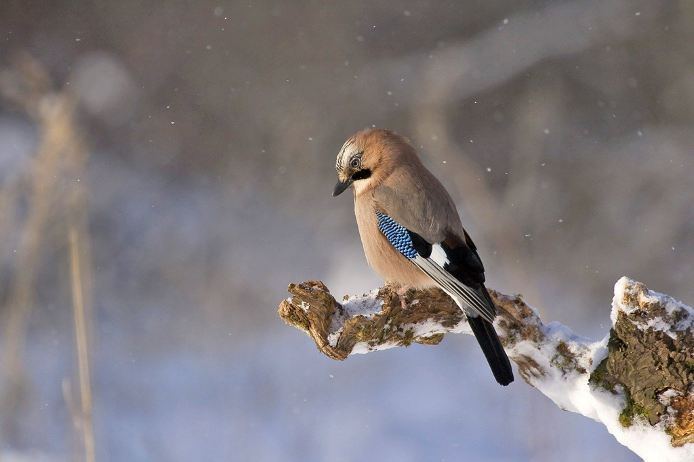

## 1

雪已经停了，路上也已经看不到白色的痕迹，只留下一些混杂着污泥的灰色；远处屋顶、树顶还是一片一片的白色，可以想像和女儿走在下面我恶作剧摇动树枝后的景象。今年的雪早了很多，坐着出租车回家路上的哥说道早上的大雪时我因错过而心生遗憾，到了下午便是漫天漫天的雪花。

女儿问，『爸爸，雪为什么是斜的？』

女儿已经过了圣诞老人童话的年龄，她眼里的闪光是期待一个信服的答案。可是信服的答案或许也是浪漫的终结，而雪注定是与浪漫相关的。

『你觉得呢？』我踢起皮球。

『就像有人在不经心地撒东西一样。』女儿望着不见底的天说着。

我笑了，毕竟孩子还是浪漫的，那么或许我们可以设想一个『撒花的仙子』。

## 2

早上送女儿去学校，女儿拎着饭兜，我背着书包，雪依旧洋洋洒洒。我们说着雪的话题，嘴里冒着热气，手却哆嗦着。我要过了女儿手中的饭兜，让她可以将手缩回衣服。路有些滑了，我们小心翼翼，旁边也是同样小心翼翼的小朋友和家长。

『走快点到了教室就不冷了，但是小心屁股蹲。』我语无伦次挥手向女儿告别。

我走回车子，耳边尽是关于雪兴奋的声音。

## 3

雪停了，周围更冷了，一会去接女儿或许会看到一个满手满脸都是寒冷的小姑娘，但是嘴上还是不住的兴奋，有无数的今天发生的事情要和爸爸分享，而雪或许会带来一些不同。

## 4

我坐在书房里，书架上是满眼的知识和不同的人生，任何时候拿起一本，伴着我自己磨制的咖啡，总是无比惬意。

有时候，只是希望一些简单的幸福可以持续，那么自是『不羡鸳鸯亦不羡仙』。
