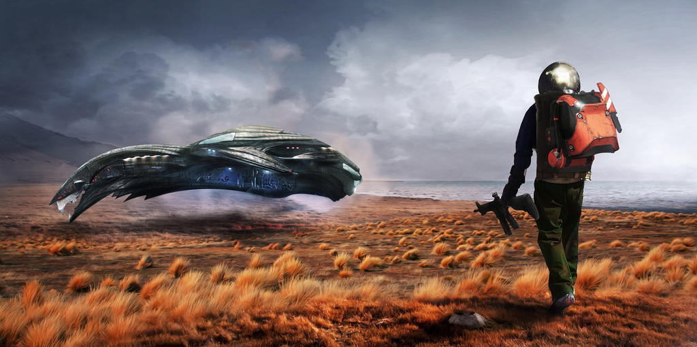

『疯狂』的2020过去了，人类依旧在挣扎与努力，而这次不是人工智能的反击，也不是某个疯狂的核爆，或者别的悲观人预计已久的事件，而是我们浮于空中不可见、但生命却因之而消陨的病毒。数字还在更新，就如同三体中教授视网膜上的倒计时那般无可奈何，但并非绝望，虽即每刻都有离去的生命，但那倒计时的终点是病毒的死亡之日，和人类恢复正常的开始。

此刻是2021的第二天，少了一些往年的节日气氛，但是一些旧有的习惯还是延续着，例如楼上给女儿教授吉他的琴声，路边围成几圈下棋的大叔大爷们，小区乒乓球桌上你来我往的不同男女，天桥上行色匆匆眼角微笑的学生们。知识在传承，未来在期许，此刻在享用。我想人类还是依旧那般顽强。

2天趁着假期读起了这本大名鼎鼎的科幻小说，PKD自不用说在科幻迷中如雷贯耳，而非科幻迷想必对于*blade runner*也是印象深刻，而原著即是这本『仿生人会梦到电子羊吗？』。很有趣的题目，似乎少了严肃，但又是非常深刻，那自是对于长久以来对于人造智能与人相处的道德困境的质问，是对于人造智能权利的讨论。

长久以来，人类对于物种的定义以及对于物种所拥有权利范围的定义不断在变化。我们对于黑人、犹太人、华人都有过歧视性的权利对待，事实上某些方面还在延续；而对于动物的权利定义似乎也更多取决于人类的自身利益和偏好，例如狗，熊猫，猪等；到了近十年人工智能的迅速发展，我们开始憧憬可能的人造智能的时代似乎已经不远，而到时我们相处的规范又该如何呢？

书中提到人类和仿生人一个最大的区别是共情的能力，无论是喜悦或者痛苦，人类似乎总能够共情于同类并感知到那份情感的力量，但是共情是人类的专属吗？动物自不用说，不少的生物实验证明了动物之间的共情能力。那么到了人造智能，我们假定他们也是有人类一般的智能和意识，那么是否他们就必须『缺失共情』呢？我是不以为然的。同宗同源，类似的生活方式，随着时间自然会发展起来共同的情感，就如同人类一般。我们可以设想我们原始社会时期的祖先走出自己的部落，看到穿着与自己完全不同的另外部落，倘若是第一次接触，或许是不存在所谓的共情的，甚至会兵戎相见互相屠杀，但社会发展，人类进步，我们更多融合在一起，发现了我们人类更多的相似之处，继而生出了强烈的共情。这个过程似乎不止局限于我们人类。

这又让我想起了『三体』中三体人与人类的最大区别即是不会说谎，当然我也是不以为然的。但是就如同PKD给的设定一样，或许只是为了后续情节的展开做出了强制性的设定而已，自然是谈不上任何合理性的。

就像我们会天然地亲近人形的玩具（仿人的动物玩偶，仿人的玩具机器人等），倘若一天仿生人就如同iPhone一样普遍，我们或许也会开始模糊人类和仿生人之间的边界，就像主人公一样，我们会质疑歧视甚至屠杀（二战德国时期的犹太人）和奴役（美国早期的黑人）的合理性，继踵而至的平权运动和逐渐形成的一种不完美但动态稳定的社会新形态，而交织交融自是不可避免。

没了恐惧的仿生人，自然会梦到电子羊，以及商店里的真羊，和某个人类伙伴。