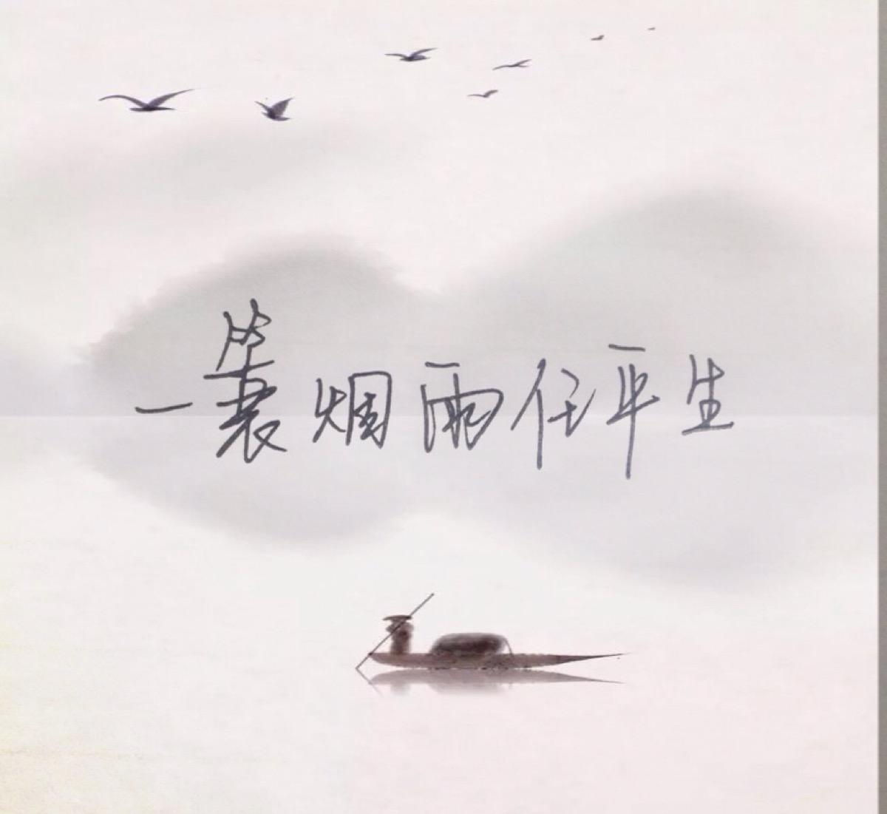

很小时候起就开始读古诗，当然那时更多的是学业的要求，并没有任何乐趣于其中，甚至会恨起作者起来，恨他用词的乖僻和似乎没有丝毫关联的字句。这其中招恨的诗人自是少不了*苏东坡*的。无论是写西湖的『欲把西湖比西子，淡妆浓抹总相宜』，或是中秋月夜的『但愿人长久，千里共婵娟』，或是雨中悠然的『一蓑烟雨任平生』，或是悼亡妻的『相顾无言，惟有泪千行』，或是黄州赤壁的『谈笑间，樯橹灰飞烟灭』。那些文字逐渐不止是考试的题目，而是无声中会想起的字句，妥帖而精确，『增之一分则太长，减之一分则太短』，此时此刻，此情此景，唯有此句。

还记得读大学的时候，一日与室友三人同游百望山，景色已经不再记得，现在还经常想起的是一路上山时大家一起诵读古诗词的情景。或者李太白，或者苏东坡，或者辛弃疾，或者陆放翁；或是豪迈，或是婉约；或是凌云壮志，或是亲情爱情，或是边疆沙场，或是淡泊人生。步子轻盈了许多，没多久，已然登顶。又一次，和高中同学骑车去鹫峰，那自然是辛苦的事情，在茂林修竹中间穿梭，然后坐在一处石桌石椅上，一首情诗刻于桌面，读罢，虽谈不上文字传神，但感情之充沛也是让我至今仍是记忆犹新，或许那便是年轻的痕迹。

过去几年经常会去杭州旅游，有老婆和女儿在旁。一次我们住在西湖近旁，晚上西湖漫步那自是一大乐趣。行走于苏堤之上，湖面上灯影绰绰，远处山影阴森微微可见，不经事的女儿不久自然喊累，我说与她关于东坡的故事也自是没有用处的，于是抱起那时还小还轻的女儿依旧走着，想起东坡做此建设时的光景，那自然是相当不易的。夜风带走了白天的炎热，近水时更能觉着凉爽的意味，想必近千年之前的东坡也经常会夜行于此，或者泛舟湖上，有同好的好友、有美酒相伴、有秀美的景色，那自是流连忘返，不知此身何处。杭州与东坡，那自是相映成趣，互相成全，千百年书写西湖的诗词不计其数，然而东坡的诗那自是拔得头筹的；而东坡在此为官数载所做之建设，所施行之法度，所成就之功绩，杭州人自是津津乐道，如同与邻人说自己的儿子。

小时候三国的故事是我最喜欢的，无论是罗贯中之『三国演义』，或者三国的游戏，从来没有中断过时间的投入，各个人物的名与字，各个重大的战役也是耳熟能详，当然其中的赤壁之战，那自然是最为喜欢和感慨的。罗在其中着笔墨甚多，而当时各个英杰也正是壮年之时，而结果或许也是最为重大。周瑜的羽扇纶巾，诸葛孔明的舌辩群儒，黄盖的草船借箭，关云长的华容道义举等等，一切一切都是精彩而缜密，似一环出错则赤壁不再，而后的历史也将重写。东坡游至此时，胸中的激荡那自是难以名状，或许只能付诸于笔墨，于是有了那著名的『赤壁怀古』和前后赤壁赋，与那场战役相应成章。我在想，诗人之于你我普罗大众，不同的是具象于文字的能力，或许每个人都有激荡的情怀而不能自已，但我们困于词穷怏怏而归，诗人则可抒情怀于诗句，酣畅淋漓，畅快无比，后人也可借此诗句来舒解郁积于心的感情，那一刻与东坡达到共鸣。

再者是子瞻与子由的兄弟之情，古往至今，兄弟之情总是淡漠多于热烈，而似二苏的情感那更是几乎没有。东坡每每念及子由都会感慨万千，借助于诗词、信件、或者同住一段时间，二人是不曾远离的，及至东坡染病而快要仙去之时，也要子由来给自己写墓志铭，或许也只能借助于『千里共婵娟』那一轮明月来消解同时不同地的遗憾。时间与空间，总是折磨人，『君生我未生,我生君已老』那是时间的无奈；『庭前枇杷树，吾妻死之年所手植也，今已亭亭如盖』，是时间的无止休；『纵使相逢应不识，尘满面，鬓如霜』是时间的无情。『两情若是久长时，又岂在朝朝暮暮』是对于空间的达观；『海上生明月，天涯共此时』是时间对于空间的弥补；『春风得意马蹄疾，一日看尽长安花』，是情感对于空间的扭曲。子由是务实而拘谨，也不似东坡一样太过起伏，也似曾有一些积蓄，于是哥哥落魄之时，弟弟自是最好的资助来源。无论是京师，或是贬谪的某个处所，或是流放的路上，二人总能小住一些时日，我想那些日子，目光也是温柔的，记忆儿时蜀地的趣事自不能少，回忆宦场沉浮抑或人生得失总是在美酒中轻轻一叹而任由他去，末了弟弟还是弟弟，哥哥还是哥哥。

而过去的文人似乎并不纠结于某个长久之地，而是漂泊于整个中国，当然宦场之人『我命自是不由我』，但那种淡然的接受和迅速的融入还是让我所钦佩的。反观我们现在的人，似乎没有丝毫勇气离开这业已习惯的场所，业已习惯的餐食，和业已习惯的关系，而此方面似乎西方人更像东坡和游走洒脱的道士，纽约、波士顿、洛杉矶、巴黎、伦敦、东京都会留有足迹，如是或许最终安定之所已无关紧要，而紧要的是内心的平静和豁达，那是鲲鹏『怒而飞』『徙于南冥』知道天有多高地有多宽之后的淡泊，而非囿于小城小镇的小民终其一生无知之下的平淡，我不论其好坏，或许某种意义上是殊途同归，但我想我们还是更加亲睐那『不知道』到『知道不知道』再到『知道』之后的那种通达。东坡也曾遇到过瘟疫与瘴气，也曾见到自己亲近之人离去，但脚步不曾停歇，大江南北都曾留下脚印，而声名也是响彻寰宇。如今，我们再走在徐州、杭州、惠州时，我们吃着东坡美食，行走于东坡的故地，脑中自是少不了那一段段的轶事，某一刻的某一个景致便很容易唤醒你我心中那句诗词，会心一笑之余，那个可爱的老头似乎历历在目，如在近前。

我时常在想，似东坡一样的文人屈指可数，不世出的『诗词字画』成就，跌宕起伏的人生，无数的轶事笑谈，当世的声名显赫，以及官至人极的仕途，再留下喜雨亭、黄楼、苏堤、朝云亭等等供后人凭吊，若此似乎找不出第二个。陶渊明、李白、柳永、陆游等等似乎在某一方面都有相似甚或胜之之处，但所有相加却是不及多矣，这怕也是后人喜爱这个可爱之人的原由。

至于林语堂的『苏东坡传』则是关于东坡的最好的传记，虽然初写于英文，但张振玉的翻译也算上乘，读之时不忍释卷，大呼过瘾。