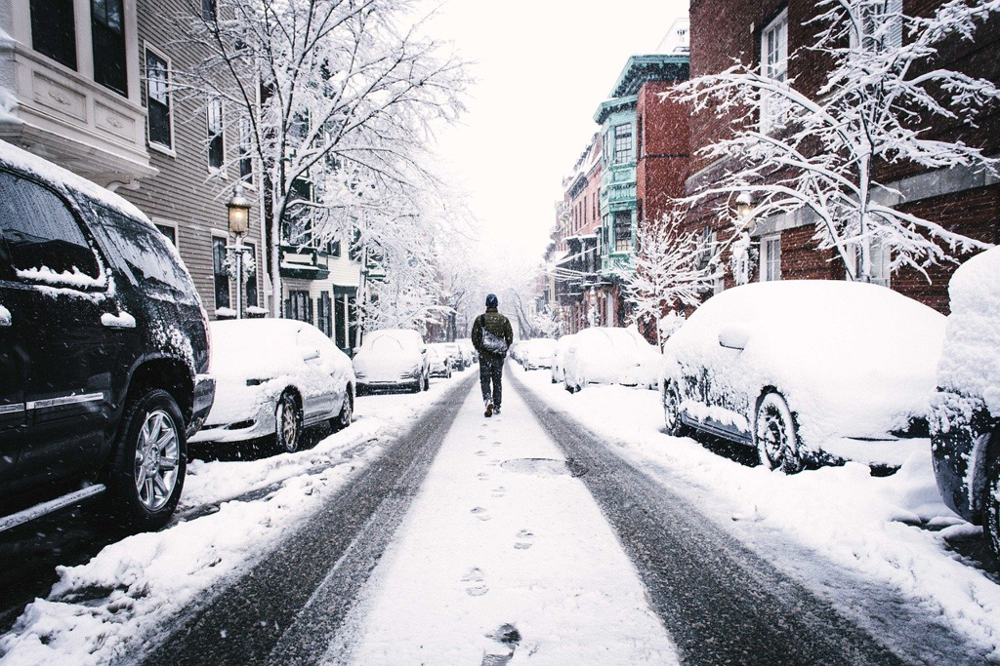

最早知道这个故事是从电影而不小说，而当时的名字是“一个叫欧维的男人决定去死”，显然这是一个更好的名字，也是贯穿整个故事的基础设定。至于后来改为当前这个名字的原因我是不知道的，或许又是一些白衬衫自以为是地觉得这个名字犯了某种禁忌吧。

巧合的如同“疯狂的石头“，但又显得不是过于刻意，甚至有些顺理成章。坚硬的心脏并非永远如磐石一般，就如同“老爷车”里面的东木，有一些属于人类的好的东西总是会有发光的时刻的，哪怕是那么稀微。一个更加内向的人通常会有更好、更加贴心的人，当然这个数量自然是很少的，通常有一个也算是幸运的，而那个人极可能就是你的伴侣。内敛的人除了可以独自面对的书籍，文字，或者音乐，与人可以舒服对话和沟通的只有那一个人，而他或她也是那个最有耐心的、愿意听你最为无趣话语的人。于是，不时地你便向其诉说，哪怕更多的是倾听，那种简单的会意自是让人留恋的。

人生短暂，青春易逝，哪怕可以平安健康地相携到老，也总有一个会先失去了会意的能力，于是目光不再清澈而是变得呆滞，一个上午或者说着听不懂的话，或者已不再说话，而只是在那里，如同雕塑一般。更清醒的那位或许会在一边一起晒着太阳，读着曾经都喜欢的小说，安静或许也是一种耐心的回应。直到某个走了，只余下一个寂寞的人影在屋子里蹒跚而行，习惯还是依旧着，只是那个数量总是太多，而屋子也总是太静。生活的意义似乎又成了一个问题。

欧维走到了同样的境地，于是死横亘不去，重复的变得不再习惯的每日更加深了这个想法。如果这时候一切顺利，欧维想必已经如愿地随她而去，但终究人生还在它自己的轨道向前平稳地前行，而不关于你的选择，有些人总是会与你生成交集。

欧维便不能如愿地去行使那最后的权力，而只能在人生的列车上继续前行，至少自己知道总有下站的时候。时间在推进，在某个车厢似乎有了一些有趣的人，那是自然而然的，如同遇到伴侣一样，而时间会不断加固这种情感，于是欧维便放弃了“跳车”的打算，而决定融入这有趣的另一段人生。这是对于她的背叛吗？最好的决定者那自然是她，而她铁定是更加希望他可以如现在一样快乐而满足地继续自己的生活的。当自己的站点终是到，两人再次想见之时，她肯定不会抱怨他的迟到，而是欣慰于他的成长和简单的快乐。

我不是所谓“治愈”系小说的目标读者，当然我也是喜欢其中的生活态度，以及蕴含其中的积极与乐观。但人生大体并非如此，而更多的是残酷与无助，我们大致不会有着类似soulmate的伴侣，自然一方的离去也不会导致我们想着随之而去，我们宁可苟活着，哪怕生活再艰苦，那空气或许不太干净但是活人尚可呼吸，那午餐不算美味但是尚且可以尝出酸与甜。甚至想死的人也自然是碰不上好的意外的，而更可能是遇到更糟心的事情，或许故事会演变为一部“黑色电影”而非此故事中的温情脉脉。可是谁又不愿意期待一个更加美好的故事呢，哪怕它在现实中绝无可能。

作者还有一部在国内非常火的小说“外婆的道歉信”，或许大同小异吧，也没有多少看的想法。