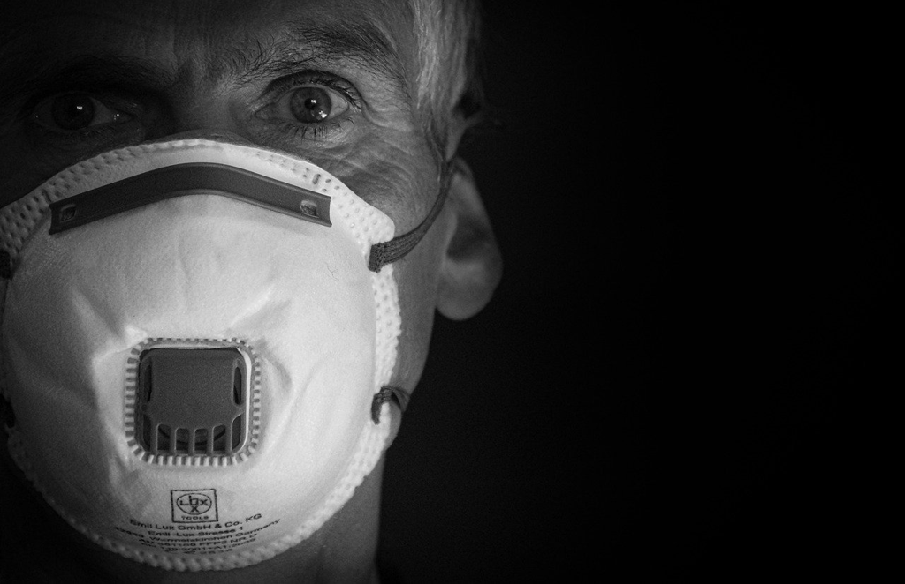

## 局外人

已经不记得第一次读是什么时候，在什么心境下了，似乎留下的印象也不太深；而这次的阅读则完全不同，虽然这篇只是其中不长的一个中篇，但是阅读的体验和生成的感受却是异常清晰而显著的。

“今天，妈妈死了”这样的开头如同诸多经典一般的如惊雷，也与结尾的“今天，我死了”很好地对应起来。前者中的“我”的冷漠似乎有些不尽人情但又合情合理，就像看到我们自己一样；即使道德再高尚的人也是难逃出其中的映射的，如果你还是个真实的人，因为你总是明白内心深处的那个顺序究竟为何，而“妈妈”在何处，自是清清楚楚。后者中的“我”也是冷漠的，哪怕我也是愿意“活着”的，但是我还是不明白为什么一定需要按照一定的“规则”在活着，否则只能上“断头台”；我对于“妈妈”的冷漠，我对于上帝的冷漠，我对于爱情的冷漠，我甚至对于“自己”的冷漠，这种异乎常人的冷漠和间离就注定了我的“死”。

“局外人”我们看到了自己，也看到了自己的毁灭，至少我们自己“局外人”那部分注定是要被消灭的。

## 鼠疫

据说疫情期间《鼠疫》这本书的销量的惊人的，这当然不算奇怪，因为加缪的这本书或许算是关于流行病记述的最知名、影响最大的书籍了。已经不记得最初读这本书是什么时候了，也不记得当时是什么感受，或许少了代入感也就简单的拿起阅读继而放下，直到去年疫情肆虐时又听到很多关于这本书的谈论，阴差阳错疫情顶峰的时候我终还是没有拿起这本书，而直到最近。

疫病总是突然的，是如山倒的，人们也是从不相信到开始紧张，继而开始主动或被动时调整自己的生活方式，例如开始小心起自己的同类、远离了餐馆、自我隔离于屋子之中，也开始羡慕起楼下树上的小鸟，居然它们那刻变得那般自由和无拘无束。开始关注新闻，小心地避免下楼，买菜也是全副武装、胆战心惊，看着数字的变化，内心十分焦虑。终于数字有了向下的变化，开始复工复学，也开始下楼，那些天和妻子女儿一起的日子里， 女儿居然学会了在客厅打羽毛球，以及后来在楼下学会了骑自行车。于是又开始关注疫苗，当然这种煎熬的等待总是长于我们的预期，而一旦研制和生产出来，开始投入使用时，我们又开始担心疫苗的安全性；于是周边的人开始接种，自己也开始接种，出去的地方也更多更远了，餐馆重又回到了日常的生活中，公园那自是周末必去的地方。

当然疫病的离去却不是瞬间的，而是缓慢的，逐渐地，甚至我们很难知道它是否会带着更风险的面孔卷土重来，至少此时印度依旧是重灾区。似乎远去的疫病带来的改变是悄无声息的，是潜移默化的，就像我们已经习惯了出门带口罩，就像我们很敏感旁边人的咳嗽，就像我们更加感受到了生命的无常与脆弱，这似乎会引起人们消费的欲望（所谓生命显得不再坚不可摧时，我们似乎更倾向于享受当下）。

书中小城的人们自然是更加不幸的，因为彼时应对的方式唯有”增加偶然性的可能“，而这里的偶然性是指的治愈而非相反，所有几乎得了便只能屈服。时间推移，人们的感情开始异化，特别是相隔不能相见的家人或情人，焦虑、悔恨、担忧等等情绪在不停地折磨着，当所有的东西都于事无补时，或许才会开始思考更加现实的东西，如医生对于疫情的投入，如想逃离者加入志愿者行列等。这数月期间所积累而不能抒发的情感，似乎在慢慢消解和冷却，时间总是最好的解药，于是当城门再次大开见到曾经魂牵梦绕而如今淡漠如水的对象时，你的感觉竟是那般复杂，让我想起了某个电影的一幕：海外服兵役的老兵十多年后被战友用车送到家门口时，面对想过无数次的住着家人的房子，跨出车门的那一刻时踌躇的、紧张的，甚至是恐惧的，于是你看到了他想回头的沉重的脚步。

时间总是残酷而可靠的，它总会让曾经的习惯淡化，而又培养出新的习惯，或许过程中有不舍、迷茫、惶恐，可新的习惯总是又如期而至，可是更为悲剧的是某一刻我们得以回到曾经的习惯，于是我们又要进行一次告别，又一次的不舍、迷茫与惶恐。

## 堕落

交通灯前和摩托车的故事还是很有趣的，不是说谁对谁错，而是那种应对方式，当时很怂地面对而不能奋起反击，而后又在脑海中不断重复另一个YY的平行故事，而这个故事会一直折磨自己，甚于在陌生人面前丢脸。

阅读中时刻让我想起的是卢梭的《忏悔录》，只是它不过是对于自己一生事无巨细地描述与分析，而更多是关于自己作为律师，对于女人，对于人生的看法和做法，因为主人公并不落实到某个具体的人物，所以或许会更加真实，相较于《忏悔录》。

面对自己是困难的，要么我们的时间主要是看到了别人的不是，于是没有时间或者很少有时间关照自己；“三省吾身”那自是天方夜谭，反思的人是非常少的。另一方面，我们即使去省吾身，我们往往会更加宽容一些，而且以“别人类似或者尚且不如”而原谅自己，但是我们稳稳地知道某个角落的黑暗和可耻，而这样阴暗的角落我们是无处诉诸的，我们在无宗教的教育下似乎只能诉诸于自己，而无暇或者虚假便让这种反思少了它应有的力量。

于是，我们喜欢卢梭的《忏悔录》自然是因为他自身的勇敢，哪怕我们都知道他也隐去了许多，但是相较于你我，那自已经是无法要求更多了。