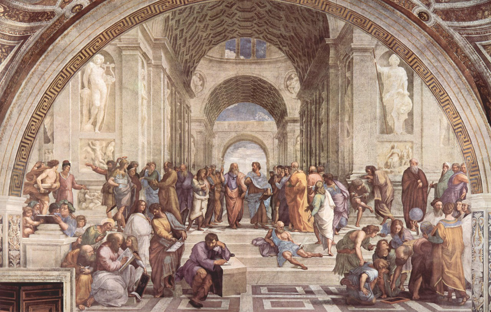

喜欢读书的人怕都有过哲学家的梦，就如同喜欢探索玩耍的小孩都有科学家的梦一般。我们或许不是想要成为某个思想强大到成为一个为万世景仰的人，或者成书立说成为一代哲学大家，我们更多只是对于自己内心的关切，这就是苏格拉底所谓的 *examined life* 。越是反思，我们越是模糊，这或许与我们的初衷是相悖的，但是倘若看到一些有趣的思想，我们也总是唯恐错过，也感概古人的睿智与似乎找寻到知己的一些小兴奋。思想接触的多了，而且似乎每一种都是自洽的，于是我们便很难settle down到某个具体的思想，而只是徘徊，也或似乱花渐欲迷人眼我们只是采撷一两支，但是一旁的花也在努力争取你的注意力。

虽然很难找到所谓“唯一真理”，但是一些哲学的思考我却是发自内心的认可，这里就简单说几个。

### 科学与哲学的关系

近几个世纪，人类在自然和科学领域取得了无比荣耀的成就，而这些成就改变了每一个人的日常的生活，继而改变了人们对于我们生活的周遭的体认，相伴生的自然是“一统江湖”的科学主义精神以及式微的哲学（包括宗教与信仰）。当科学不断取得辉煌的时候，人们尝试将这种方法论延伸到各个领域，甚至包含哲学与文学，开始尝试量化所有可能的东西，而最终将人从其中赶走，我们将其视为科学的方法。“无人”的研究，似乎代表的是知识，因为它不会因发明者而增加或者减少这种知识的作用；而“有人”的研究则似乎与其人紧密绑定，没有人了，其思想也便少了许多力量。

我也曾是笃定“去人化”的科学与科学的研究方法，但是近些年我的想法改变了不少。无论是科学的“无人”的方法，还是哲学的“有人”的方法，都是我们人类认知世界的一种方法，甚至不是唯一正确的方法。去人化的努力当然自有其价值，但是当涉及到思想或者精神，人总是难以抽离的，因为无论何种思想总归要应用到每个人的平凡生活中，而与生活的交互所形成的感受必是与人密切关联的。

那么或许我们应该要容许非科学的研究方法，我们要重视有人的认知与体验，来补充业以如此强大无孔不入的科学方法。

### 争论

作为人类，特别是年纪尚轻血气方刚的年青人，我们似乎非常喜欢在争论中获取胜利，哪怕内心有微弱的声音在告诉我们我们自己的理亏，于是无论最终结果如何，参与者没有认输的，通常也会昂首而去似乎胜利了一般，但是任何的“比赛”怎么可能有两个胜者？

沦为为了争论而做的争论，自然是解决不了问题，甚至到结束之时已经忘记了最初的争论点。于是我们便在想，如何更好地“说服”别人，那自然不是要强制性地给对方植入某种你以为然他不以为然的观点，而是去唤醒他内心深处与你观点相同的那个沉睡的想法，于是最终达到的是他对于自己思想的发掘，是一种主动的过程，而非你去强加于他的被动“暴力”。

但是，这又是何其难呀？首先被动转为主动的前提是对方有一定的基础，无论是思想还是知识，倘若对方胡搅蛮缠、毫无逻辑和开放的态度，那自是“给牛弹琴”一般；另外，整个过程应当是真诚的，而不要让对方感受到一种隐蔽的manipulate，那结果可想而知。

### 这本书

回到这本书。陈先生似乎是当下最为知名的哲学家（当然他或许不以此自居），我自然也是闻其大名久已。对于我一个所谓的哲学爱好者，以及门外汉，我更多的是将哲学作为一种工具，一种引导内心、观照生活的工具，毕竟我们总有晚上睡不着觉面对自己的时刻，所谓 *what keep you awake at night* 。因此我大体不是某个哲学家的忠实拥趸，而是雨露均沾为我所用。

这本《走出唯一的真理观》或许书名大体是最为重要的一个思想观点，当然它也非新鲜，但是在当前语境下可以有人为此高呼一声当然是极好的。不囿于所谓绝对真理，不持有静止的观念，而是更多的critical thinking，更多的理性反思；当然也并非要极端到“过度反思”，将一切否定，将一切砸碎，所谓的虚无主义。

作者关于教育与洗脑的讨论也算是有趣，他提出的洗脑中暴力的介入，以及对于其它思想的屏蔽与审查，这个在传销和极端宗教中屡见不鲜，将整个逻辑梳理清楚我想这就是哲学家的功用之一。

至于其它的非系统性的小文，也能从中找出一些有趣的思想，但总是少了系统性，而一些书籍的序的录入就更让这个书籍有了充数的嫌疑，影响了观感与评价，或许我要读的下一本陈先生的书应该会是一本系统和完整的论述。