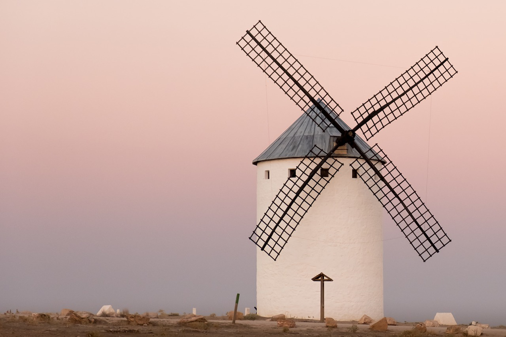

最近在公司的slack上创建了一个名为 *book_club*的channel，同事加入后，不久便有人提到了一个一看就是日本名字的作者，于是查询过后我知道她指的便是*村上春树*。一直以来，对于村上我没有太多共情，只是隐隐觉得他表达情感的细腻以及似乎贯穿于日本文化的对于形成上内心和精神的探索，这些大体都是很难琢磨的东西，于是很多时候某些人物的自杀似乎就处于我的理解之外，而注重逻辑的理科生往往会痛恨如此的随意的。然而，时间流逝，人总是会长老，也会过了为衣食而奔波以至于无暇思考意义和价值的时候，于是某一天我们开始关照自我，开始思索近旁似蝼蚁一般永不停歇的人们追寻的目的，于是似乎就离村上近了一些。

村上的人生似乎算得上顺利，刚好和*是枝裕和*的*比海更深*的主人公成了相反的对照，*筱田良多*也一样处女作便获得了*成功*，即获得了奖项，所不同的是村上自此后便不断推出新的作品也逐渐取得自己的名声和地位；而良多则一蹶不振，受困于生计，而不曾再有作品出版，以寻找素材为由苟且而过，但成为大叔以及与妻子离婚也不曾再有更多发展。或许，普通人的人生也是类似，更多是似良多一般的不顺利，而终是落得碌碌无为，又哪有几个会和村上一般如此顺利而达成了自己的愿望，甚至在写作之前的餐馆也是经营的有声有色的。

那么村上的处女作究竟如何呢？于我其实是很难评判的，或者说是没有资格来评判的。那就谈谈我的直观的感受。如上所述，情节或许并非村上关注的重点，而更多的是传导一种感受，一种某个生活时刻的领悟，那么此时作者已经表达完毕，读者是否可以同感似乎并不再是作者的问题了。我此时在思考我是否有同感，看着笔记上的几个摘抄，大体如下。

> 有钱人什么都不用想

在某些方面这自是真理，不用想也没有过多的忧虑，或者说至少不存在生存方面的忧虑。普通人的压力自不用说，那是没有停止的时刻，也没有“不用想”的时候；但是有钱人不用想似乎更多的是一种自由，是一种不用想的选择，而我们没有。

> 假如活着不给任何人添麻烦该有多好！

我也有同感。我们身边的人，我们的亲人和朋友，我们在人生中一起经过的人们，或多或少总是有给人添麻烦的时候，哪怕小到借人家的表看下时间，大到“他人即地狱”的折磨。或许我们会以别人也给我们添麻烦呀来聊以自慰，这自不为假，可这是否可以成为我们给别人添麻烦的理由那自是人生理念的沟壑了，我个人当然是为不以为然的。

> 他的小说始终没有性场面，出场人物没有一个死去。

或许这是村上借鼠之口说自己吧。性自然是不能少的，但性场面是否必要似乎各持己见；小说当然不是记录片一般的无差别记录，甚至到极端的直播的细节和琐碎，小说似乎更多是“剪辑”后的结果，是提炼与抽象，以及混合，人物不再是单一的个体的临摹而是多人的综合；人生乐趣以及人物关系的媒介的性自然是少不了的主题，但是但凡成年有过此经验的人自然明白个中感受，而作者的描述总是与我们心中的设想差别不小的，但是我们知道的乐趣与行为本身的意义或许才是更加重要的，因为那通常会涉及到形而上的精神，或者重要到影响人物的走向和内心的安定与否。

----

当然，这不算是一部难看的小说，但是几乎可以肯定的是，大致一个月后我可能不大记得它讲了什么，也会忘记自己阅读之时的感受，但是或许这并不重要，或许某些此时我无法具象、无法言说、无法形诸于文字的感受和意义已经溶入在某个重要的地方了。