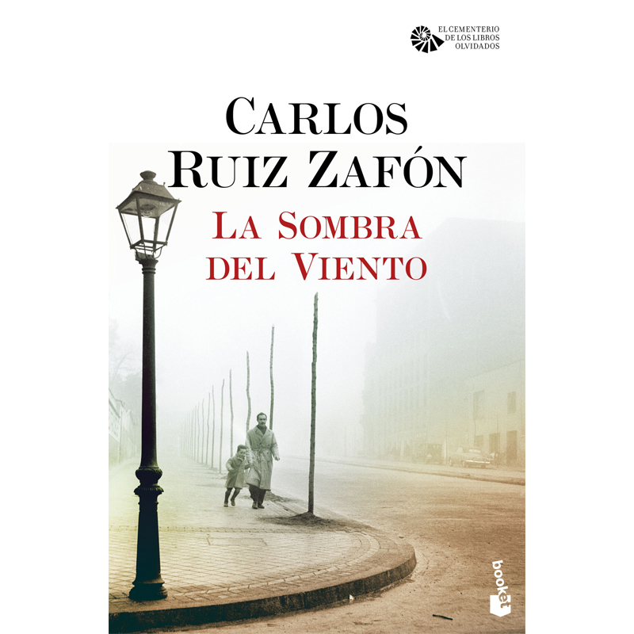

有时候读书是一种巧合，也就是说即使书架上堆满了想看的书，但是你不曾计划的书却跳出来超越了其它，于是可能失望，但是又是好奇，终于是把它给读完了。这本《风之影》即是如此。

书籍的封面和故事的开头直接将我吸引，特别是当提到“遗忘之书”时，提到一本书之于一个人的重要意义的时候，我是很有触动的。记得上中学的时候，家里是没有书的，也是没有多余的钱来买书的，于是一本书对于像我这样爱书的小孩的吸引力是可想而知的；若干个周末，在局促的小书店里，或者街旁的书摊上，总是驻足着一个少年，从背影即可看到那份专注，倘若可以看到表情那大体可以推断此刻的情节和发展。那时不曾有一位慷慨的书店主人，或许是因为大家一样都很穷，于是对于驻足其中却不去购买的穷学生，表情和态度所传达自然不是热情和欢迎，而更多是一种无奈和包含有些微认可的鄙视，但是碍于读书人的情面也总不至于将那个少年赶出；当我盯着一些陈旧的过刊，或者有些缺损的书籍时，我投去问询的眼神希冀可以有巨大折扣时，大部分时候总是可以得逞的，于是小心翼翼地拿出那从嘴中挤出的一点钱去交换，以及离开时轻盈的脚步和脸上的笑容。

我在少年时读的书如今想起，似乎有类似于“风之影”一般对于主人公有重要意义和影响的书，那便是《红与黑》。有意思的是，我从中看到了自己，就像丹尼尔和胡利安，读者与作者甚或书中的人物都似乎溶而为一；于连自不用说，数百年来一直在影响着世界各地的青年，那似乎是贫穷宿命下的一种道路，至少于连在努力地挣脱宿命，挣脱贫穷，或许很多人不认可他的方式，他的不顾一切，但或许那才是他唯一的希望和筹码，哪怕摔的粉身碎骨。于是，我也在少年时期有了一些于连的影子，那种不管不顾，只为了既定的一个明确的目标，或许中途是艰难的，甚至要突破内心的怯懦和自卑的那种天人交战也是未经此的人很难体味的。

至于这个故事本身，当然是很抓人的，没有过多需要思考的地方，只要顺着作者的线索一直向前即可，再加上作者融入的悬疑、虐恋、仇杀、扭曲，和放置于西班牙那个特殊的时代，一切则顺理成章地精彩。而阅读中强大的宿命感，似乎整个故事不是充满变数地向着未知发展而是只能按照既定的情节来铺展开，不能生有任何的分叉。胡利安与丹尼尔，甚至丹尼尔的儿子，似乎就是在反复着一个悲剧，一代一代重复着同一个故事，哪怕个中人物有少许变化，但是似乎一切都是决定主义的。回到那书籍封面上的巴塞罗那浓雾的早晨，父亲带着十岁的儿子走向遗忘之书，我难以抑制地想起了我的女儿在自己房间里阅读的神情，那是那般的关注，而脸庞则似电视一般播出着此刻自己所看到的故事和自己的心情。

女儿和我走在小区电梯看着内壁上悬挂的几面镜子，总是会从中看到无数个自己，女儿惊奇于中，询问到底有多少。我想到了无穷的广阔，以及自己作为一个“一”的小，愈远处的女儿和我已经很难看清了，不过恍惚中我们在电梯中的稍许移动也总能带来那对父女的变化，似乎那刻我看到了若干代后的子孙，哪怕代际的更替，传承似乎变少变弱了，但是影响却是不可忽视地存在着。那莫非也是我们来此一遭的意义吧。
