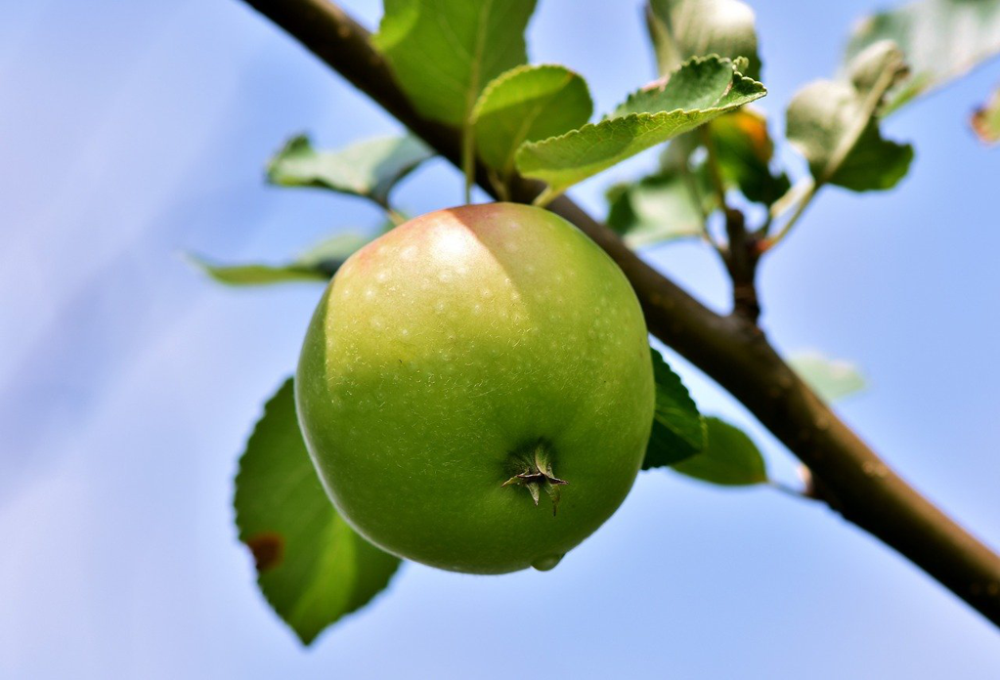

当数十年的时间可以用几十个字来概括时，我们从中看到了残忍，看到了沧桑，而在心中的唯一印迹也是那般的模糊，隐隐地有一团影子，但是又看不真切。还好，我们人类发明出了照片与视频，于是那刻的定格会有具象的表达，会更加清晰和无歧异。翻看旧时的照片，看到了是某时某刻的心情，那曾经属于自己的面容似乎只一瞬便被时间刻上印痕变成了此刻的自己，相册这头的自己微笑着也伤感着。时常告诉妻子，或许此刻永远是最合适拍照的时间，因为此刻必是我们余生“颜值”的最高点，而往后自然是一路顺坡而下了；妻子听及也是略微心酸的会意一笑，自然时间对于女士总是更加无情的，而或许我不应该讲出这残忍的真相。

我们留恋儿时的任何物事，无论是那方土地，还是那群人。

土地总显得那般巨大，任我们的脚总是丈量不到其万一，而家近旁的所在却已如自己的身体一般熟悉，一分一毫无不了如指掌；和儿时伙伴走在小渠上不时看看干涸的渠道，里面不时有青蛙蟾蜍在跳跃，也有灰土色的小蛇在蜿蜒爬行，倘若我们有不错的兴致，某个小蛇或许就会成为我们手中的玩物，有趣的是我现在是极怕蛇的；热烈的太阳的暑假总是我们小伙伴的好时光，这时大人通常是要午睡的，于是我们几个摸着出也门相跟着去玩耍，那时家附近是有家制砖厂，而里面是有个小池塘的，于是大太阳更加显得那水的沁心的凉爽，或者便去果园，夏天是收获的时节，有桃子、李子，而我们最喜欢的自然是西瓜，如港片情节一样伙伴们分好工，有人便悄悄地摸过了瓜田，一会便手捧两个大西瓜和其他伙伴扬长而去，那时是不懂西瓜的，自然也糟蹋了不少。

人才是一个地方的灵魂，在小小的村庄里，不时总有各种不同的传闻，虽然很难求证，但说的人大体也图个嘴巴的爽快和成为中心的喜悦，听的人也宁可信其有地附和着，这些传闻大多是所谓“坏事”居多，例如谁谁又扒灰，谁谁又生也怪病，偶尔也有某个家里出了个大学生。我大多是不信的，但是不时也有真的“喝农药”的提醒我村庄似乎也是存有更深的悲伤和痛苦的。我高考结束后的暑假在家无事，于是给几个邻居家孩子补课，自然是语数外，我也偶尔给他们放放我收集的歌曲磁带，还清楚记得大家一起唱小虎队“爱”的情形，若干年后再也没有听到她们的消息了，想必没有上大学而终是嫁给附近村庄了吧。十几户相隔的邻居叔叔自我有记忆起便是忙碌如牛一般，很早他担着粪到自家果园，因我家门口是必经之地，所以不断看着那个弯曲的身影从门前的村路走过，那如同一个钟摆一样，似乎有些麻木，但也是坚定的，似乎永不会停，直到失去了“发条”的时候；下午，无论寒暑，他会牵着一群羊往北边走去，随着羊或走或停，自己也似一只羊一样融进了那一群之中，远了，直到区分不出人与羊，只看到一团移动的云；即使勤劳如此，也终是过不上一天宽裕的日子，大儿迟钝且懒惰，生也一堆孩子（据我母亲说后来生孩子可以“卖”给别人，于是似以此作为生意了）；二儿游手好闲一次偷电缆于是坐进了大牢；小女儿天生智障，嫁人后不久因生孩子而死。我不能设想这个叔叔的心情，以及如何抚慰自己，更多的时候我只看到的是更多的白发和更加弯曲的身体，而那早上的担粪和下午的放羊也不曾落下过，想必广阔的蓝天将自己化作一只羊的那个时间才是最幸福的。

土地和人总是萦绕着我们，无论我们此刻身处何地。土地在微微地变化着，或是增加了房屋，或是少了一个果园，远处的山不再那般清晰，曾经那山上的小房子似近在面前，而再是看不到了。物是而人非，一些人早已离去，例如村子里逢年过节压面的那个叔叔，例如隔壁小学同学的父亲，例如对面我给补课的小姑娘的父亲；留下的，如同村中不多的老树一般，还在随着四季在变化，只是那叶子少了许多，那绿色也不似曾经。母亲告诉我，村里的年轻人大多已经不再住在村里了，或者在县城几十层的高楼中有一个自己小家，或者客走他乡成了异乡人。田地大多荒芜着，因为粮食是卖不出价的，而那份辛苦却是显然的，于是街上除了还是欢快跑着的小孩和不远处的爷爷奶奶，这个村庄似乎成了一个文静的姑娘。

----

《四个春天》最早是从电影知晓的，但我更加偏爱文字，因了抽象之下的想象空间。这是一些散文，我更加喜欢其中关于人物的部分，更显得的生动活泼和可爱，再加上西南地区的特殊地理风貌，似乎给人增加了一些侠气，或如山般的执著劲；有山隔着，隔住了外面的浮躁，也隔起了一片世外桃源，其中之人更加平静，养花弄草、爬山野游、抚弄乐器、习练书法，城里人看到的是一种奢侈而在村里却是平常无奇。末了，我们或许只能祝愿这些父母叔姨们可以长寿一些，让这份平淡的幸福可以长久些。