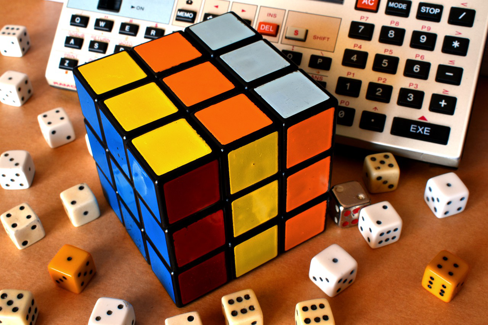

最近喜欢上这一类科普的书籍，也就是湖南科学技术出版社的第一推动系列，整体而言系列中包含的书籍还是质量不错的，
再加上不错的翻译，整体的可读性还是非常不错的，例如几天前读完的[复杂](/complex-theory/)，还有就是这本
《逻辑的引擎》。

我算是接触计算机比较晚的，高三后开始学习五笔到大学起开始正式学习计算机（我的专业），而后到研究生毕业后将
程序员作为职业，整体算起来也不算短了。那么此刻思考计算机和我的关系，我应该如何定义呢？

首先和大家一样，2003年左右最早开始使用QQ可以和不相识的朋友聊天，那种感觉还是很奇妙的，因为似乎一瞬间我的人生的
宽度增加了许多，而更多的是增加了一个可以『无话不说』的渠道，于是我当时在网吧更多的是去和别人聊天，似乎有说不完的话，
哪怕只是陌生人，哪怕至今也不曾见过。继而是游戏，我从来都不是游戏的重度爱好者，但那时还是很喜欢和朋友一起去打CS，去
体验被别人虐杀的同时，也会偶尔自己偷袭成功不多的几次。至于计算机我的专业，那时的老师当然是不太合格的，经常自己就会被
绕进去，而教的书籍也是古老而且无用的，计算机上机也只是敲打着Pascal的简单算法，小心翼翼地拿着载有作业的软盘，甚至学校
又要求我们学习了一遍五笔。到了研究生，到了北京，至少我知道了清华科技园附近出租屋里各式梦想的创业者，而我也有幸加入了，
用着自己不多的知识将其转换为不多的RMB，再到后来因了英语不错有了远程的机会，或许那刻我更加明白了，计算机和互联网的更大
意义上的价值和影响。毕业了，在北京做游戏，那是辛苦而且快乐的，那时也不要求版号，虽然若干次公司临近破产，但是终于若干年
后在我离开公司几年后顺利成为行业的翘楚，而创始人也自然是成功退出成为投资人。

上面列举的似乎都是生活相关的，而于我个人而言计算机又意味着什么？和许多计算机专业的同学一样，我也做过图书管理系统，以及
爬虫爬一些自己需要的信息，和别的重复性的事务，于是很早我便切身感受到了计算机似乎于人是简单能力的延伸和复制，将我们从
重复中得以解放。线下到线上，这不是后来的O2O，而是互联网和任何线下行业的一个自然的连接，例如电子商务，联机游戏，即时通信等。
以及一些前沿的探索，如机器学习、加密货币交易等，计算机也是作为算力的载体再加上从业者的一些算法，便会形成一些可观的结果。

至于技术角度，Pascal作为第一门接触的语言让我明白了算法与实现的关系，C和Java则让我明白了表达能力对于编程的影响，Python则
让我明白了快速上手、可读性、技术只是工具的本义，我们实现什么功能不能囿于我们有什么锤子，而是看这个钉子合适怎样的锤子；Clojure
则让我看到函数式语言的优美和对于系统稳定性的影响。至于是eclipse, 还是VIM/Emacs，还是Idea/VS Code，甚至你是ubuntu, Windows
还是MacOS，那则只是个人偏好，都是不重要的。

回头再看这个历程，我在不明白计算机的影响和随后出现的互联网、移动智能的情况下选择以此为我的专业，那自然是幸运的，特别是它使得我
可以不受限于地理位置（想想当下的疫情），不受限于时间，让一些机会成为了可能，特别是所谓『地球是平的』的真切体会。当然，我们仍需要
警惕反对全球化的声音日益加强，各国似乎更多朝着封闭的方向前行，更多的不确定性在发生，但或许过去几十年最美好的事情就是计算机革命和
互联网的发展。

加到这本《逻辑的引擎》，它则是从一个通用计算机的本质出发，通过回顾整个逻辑理论的历史，特别是如何通过逻辑计算达到通用计算的目标的
科学家们的努力，直到图灵和冯诺依曼最终将自己的计算机模型转换为实际的与我们当下的计算设备无限接近的通用计算机，似乎亚里士多德和莱布尼茨
的最初的梦想成为可能，虽然希尔伯特的判定性在哥德尔的不完备理论下成为不可能，但是整个理论的探索过程导致了图灵机的产生，以及后来我们
熟悉的以存储器为核心的冯诺依曼模型的出现。

20多岁时我一直弄不清楚，电脑为什么叫计算机，而它和我心中的计算器又是什么区别和联系呢？而计算器到计算机的发展，便是『通用』的含义所在，
即计算不限于所谓的代数的运算（无论是简单到加减，或许是复杂到微分），而更重要的是逻辑的运算（判定一个输入的奇偶性），于是计算机便可应用
到诸如下象棋，决策系统等复杂的系统之上。而最早接触布尔运算时觉得其过于简单也都是源于自己对于计算本质不缺少更深的理解，布尔代数当然是无比
重要的，也是现代计算机最为重要的理论基础之一，它将逻辑与代数运算联系起来，让逻辑运算可以使用基本的代数运算来完成，特别是与二进制的结合，
让布尔运算与代数运算在规则上也达到了一致性，最终让计算机的能力扩展到了通用性的层面。