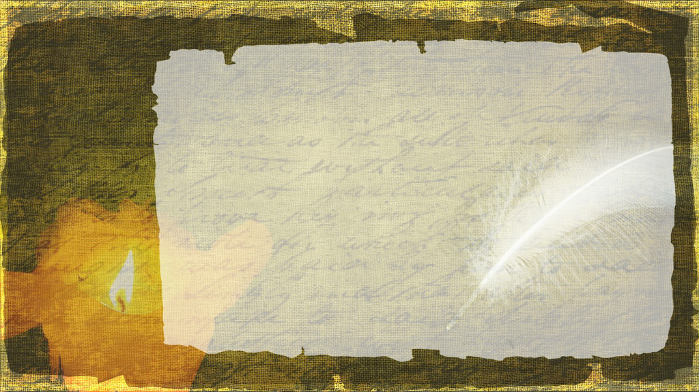

这本书算是系列中的第四本，有副标题《从唐代散文到现代文学》，自是从唐代开始说起一直到现代。蒋勋自不用多说，算是在大陆
不多的几位出名的台湾作家，也是我个人很喜欢的作家，当然相较于更为有名的红楼系列，这本书或许读得人少一些，但是我读完
还是非常喜欢的。

第一就是蒋勋将整个文学脉络梳理的非常好。自唐的韩愈和柳宗元到现代的鲁迅和沈从文，如果从对于现实的关怀、对于底层的关切
也算是一脉相承的，从没有断绝过。这当然是对于更早的只服务于上层官僚（无论是意识形态还是纯粹的美学）系统的一种改变和颠覆，
开始走近现实，走近底层，走近自己，走近内心。是从更早的重形式（乐府、诗、词等）到更加重视内容，所谓有感而发，不平则鸣。

第二是蒋勋对于一些重要作者的梳理。韩愈文字的力量和热情像极了鲁迅，而柳宗元的冷静和细致则像极了沈从文，而两种形态的美学自是
有各自的可取之处，而力量也自是不同，或许年长些时，冷静的文字会逐渐生出力量，让读者自己感受、自己去领悟，而非一种说教与控诉，
少了一种非此不可的压迫性，而是一种冷静地、冷漠地生出了自己的想法。

第三是蒋勋也在说一种处世的哲学。如同读文章一样，我们生活也需要更多的包容，更多的理解，更加的开放，一旦看到惟此一种的解释都是
需要特别警惕的。文章无论韩柳或是鲁沈，或许我们有自己的偏好，但不妨碍我们去欣赏和理解另外一种美；对于自己也是一样，如同张岱一样，
接受自我，面对自我，虽不得志，但或许仍可『逍遥』『旷达』。

最后就是蒋勋的一些推荐。蒋提到元曲（也包含宋词）都是要唱的，要演的，也自是和我们只能读的今天是完全不同的，就如同《哈姆雷特》一样
舞台的呈现和文字的观感自是不同的。于是他提到的昆曲以及别的曲种中对于经典的一些还原，似乎也是非常有趣的；而像《牡丹亭》的经典和其中
的趣味也经老师的推荐也让了生出一读的动力。至于更多的如现代台湾的一些作家，《红楼梦》的博大精深，沈从文文字中的冷漠后的真相也当是
了再读时可以重点关心的。

当然此书是整个系列中的最后一部，前三部自然也是要读的，『蒋老师，再会。』