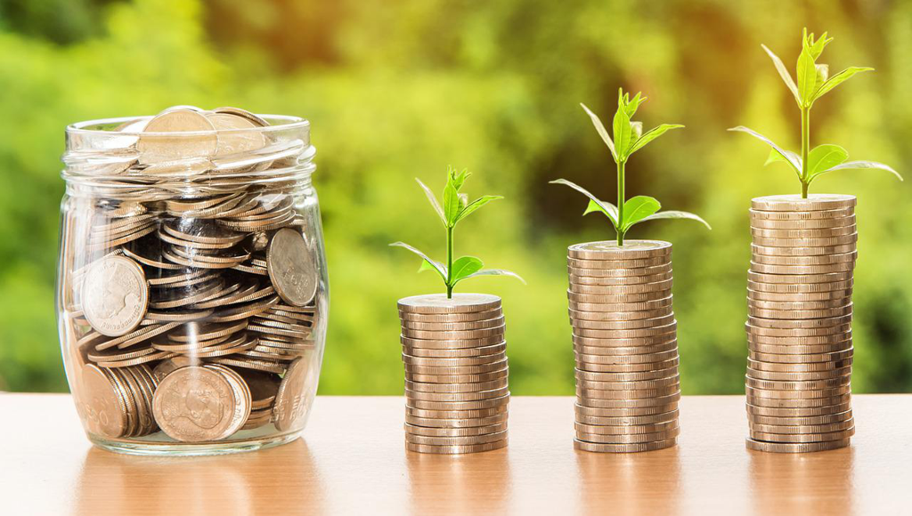

像这样的好书国内数年很难看到一本，特别是它的accessibility和对于非专业人士的友好度，再加上它『真实』的表达，
让读者可以映照自己所生活的环境，而非感受到propaganda样的平行宇宙，这也就解释了它高达9.0的豆瓣评分。印象最深的
是作者对于经济理论需要根据一时、一地、一人而具体应用而非理想主义的去掉国别在『真空』中的讨论，自然任何的决策都是
受限于政治与利益的，也或许是在此之下可作出最大的妥协，于是即使并不完美，也伴随着很多的批评，但是中国经济发展所带来的
切身的感受，这自然也是不容质疑的。那么，经济政策是在一定的界限下妥协的结果，如作者一样的经济学研究者也自然是有一定
的红线所限定，显然作者虽然『戴着镣铐在跳舞』，但跳出精彩，跳出了信服。

一件事情，特别是影响巨大的事件，回溯尚且困难之极，而在其中实时地做出决策那自然是更加困难，也难免有所失误，而科学和理论
正是为了降低这种失误的程度和概率。经济学史让我们知道了经济危机时需要采取的应对方法，于是各国政府应对起来便不再那么慌乱，
而一些曾经有争议的政策也可以顺利推行，最终也将经济危机的损害降到尽可能地低，相应的也是更多民众的受损减少（当然，更加底层
的人会在经济下行中影响更大）。危机当然不可能一劳永逸地预防和解决掉，世界政治气候也在不断变化（贸易保护等），偶发的事件也
时有发生（新冠，战争等），所有政府的挑战是永远都存在的，如何更从容地应对，如何将损失降到最小，这自然是考验政府执政能力的
关键节点；而专家（如作者这样的经济学家）则需要贡献自己的智慧，『提出好的问题』，在学习历史经验下，在结合实际情况来采取
尽量合理的政策。当然『身在此山中』，也逃不掉客观的局限，但作者倡导的『实事求是』是一个基本的前提。

过往40多年的经济发展所取得的成绩有目共睹，那么未来呢？特别是在贸易保护思想回潮、新的可能的技术革命（AI为主）的出现、各种不确定因素增加等
背景下，我们是否还能够延续稳定的经济增长，这是大家都关心的问题。当然作者给出了自己的一些答案。

一方面是重资本到重人的转变。经济从生产业向服务业转型是不可避免的，而之前我们重视的资本的投资也是基于当时的社会阶段，也取得
了经济快速发展，城市化率大幅提高的结果；但是，人的相应投资占比很低，如教育、医疗、养老、住房等民生领域，再到人力资源的自由
流动的限制。倘若这些问题可以得到解决，民众的安全感提升，储蓄率下降，消费提升，自然所谓的国内消费内循环也就会起来。

另一方面是政府职能的转变。经济发展到一定阶段所对应的政府职能、法律、产权保护等也需要发展和匹配，例如更加健全的法律，更加完善
的产权保护，政府向『服务型』转变等。而我们的一些政府结构的优势，例如『地方一定的自主性+中央的统一协调』也能让能动性得以发挥，
而一些政策的调整和二次分配等，也可以减小经济不平衡，减小贫富差距等。

当然，『人民安居乐业』是大家都认可的共同目标，但是达成目标的过程则是很难有一致的见解，如何在不同的发展阶段做出合适的路径规划，
让政策的调整尽可能小地影响到利益相关者，最终达成目标，这或许这才是考验政府执政能力的时候，而专家也希望不要为利益所绑架可以为
政府出谋献策，让民众都可分享到经济发展的好处。