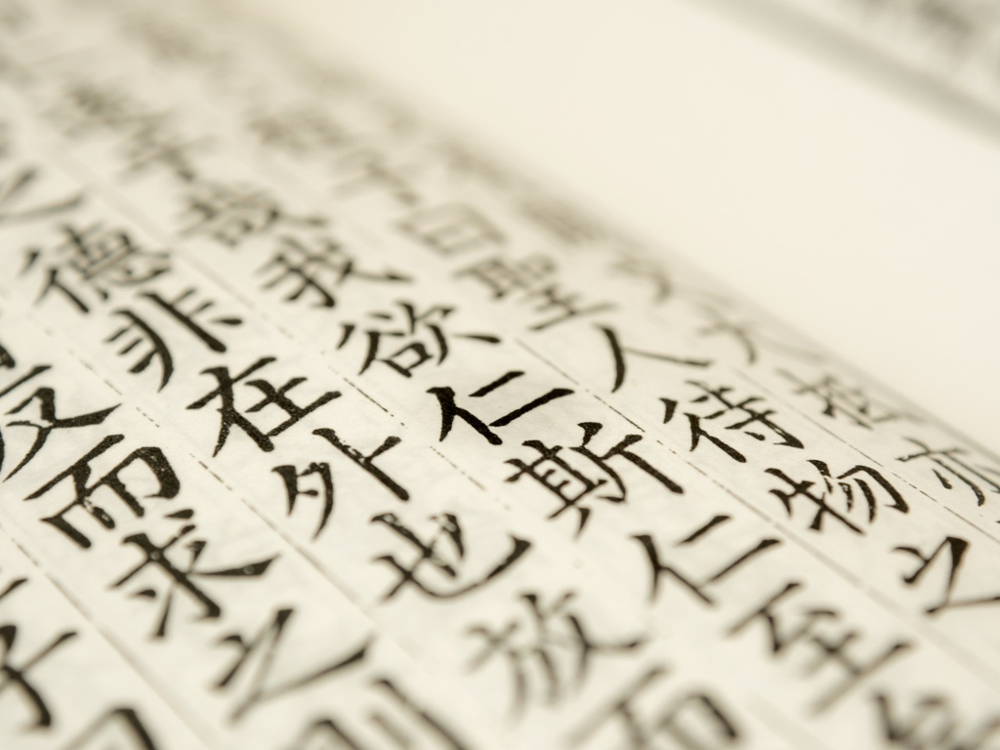

此书自不用介绍, 也是一直想读的一本书, 但都是因了不同的原因都耽搁了,
直到今天才得以读完. 阅读的过程有个小插曲, 就是开始是读的英语的原著,
突然发现所引用的古籍文字是很难对应起来, 于是还是读起了赵复三先生翻译的版本,
这才看着古文与其思想的联系, 思考着我们自己民族构建的哲学体系.

很多在当下看算是常识的哲学思想, 诸如儒家的仁义, 道家的无为, 墨家的兼爱,
以及程朱的理学和陆王的心学, 可是倘若回到作者的那个时代,
我们是缺少这样一本对于我们哲学体系和传承的梳理;
当然夹杂的一些40年代的社会现状的评述自然已经过时,
可当下的我们所形成的道德规范的缘起是我们所要重视的.

之于历朝的统治, "外儒内法"的提法已经不鲜见, 外表倡导的儒家仁义和入世,
一者使得"天下英雄皆入我彀", 一者也让普通人看到了阶层越迁的可能;
实际执政中的高压法令, 使得人心惶恐, 矛盾丛生.
于是形成了"眼看他起高楼, 眼看他楼塌了" 循环往复.

之于统治下的普通民众, 儒家的入世与道家的出世, 自然成为读书人行为的合理性依据,
进则可登堂入室, 兼济天下; 退则可引入山林, 独善其身.
而且他们还可以嘲讽"世风日下人心不古国之不国"等等,
可主流的还是被伯乐识得的千里马,而不是淡泊的庄子. 

我们的哲学似乎也在设想一个完美的社会形态, 例如孔子向往的"老有所终, 壮有所用,
幼有所养"以及"外户而不闭"的"大同", 还是陶渊明假想的"不知有汉无论魏晋"的桃花源.
可看着我们此刻的道德和生活水准也似离那些目标还是相差甚远,
当然那也是我们需要奋斗的目标.

先贤的哲学依旧闪亮, 甚至从不亚于同时代的西方(例如希腊或者欧洲),
可到了近代似乎我们断代地缺少了大师, 我们缺少思考者吗?
如此基数的国家我是不相信这中间缺少深度思考的人, 可见诸文字的少,
有深刻见地的更少, 至于个中原因我们也是需要反思的.
而引入的哲学著作总是有一些梳理, 或是源于文字, 或是源于社会背景,
总之我们需要了解我们自己的哲学家,
当然倘若可以吸纳人类共有的哲学智慧再结合我们自己的形成一些深刻的见解,
那当然是我们所有人所乐见的, 就像冯先生的这本书.
