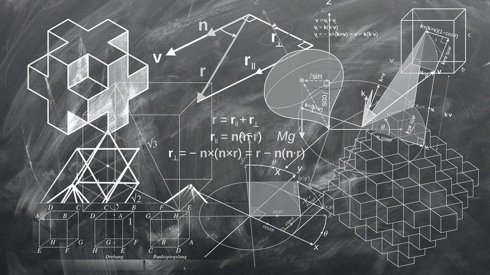

数学作为科学的王冠一直坚挺在那里, 它在现实中指引人类前进, 例如行星轨迹的测算,
太空船的远程控制等; 也用巨大的力量让我们反思哲学上的意义,
例如是否一切都是可计算和预测的, 也就是是否人类有自由意志, 我们知识的边界在哪里?
当然作为基础的数学总在那里, 那里有实际的应用, 也有美感的传递.

这本书作为一本数学科普书算是中规中矩, 或者是受限于作者的阅历,
或者部分是因为翻译的问题(最近愈发觉得语言本身的重要),
最终呈现的结果是深度和广度都差很多,
例如关于多个数学分支的融合谈到的笛卡尔坐标将几何与代数融合,
集合论试图将所有数学分支, 可后者的论述具体是如何达成的则没有涉及.
至于后面计算机的介绍, 也只是一些简单历史的罗列, 对于程序的可证明性,
量子计算机中数学的作用等都是没有涉及的.

下面简单说说几个我觉得还算有趣的地方.

关于数字的抽象化. 我们现在到了3岁开始讲话起便可以知道一些数字,
甚至以数到100为自豪, 可是我们没有想过诸如数字10的含义,
它是10个橘子还是10个糖果,或者是10个妈妈的批评, 仔细想来数字本身是抽象的,
它是可应用于任何可计数事物的数量表征, 可是它到底是什么?
既看不到也摸不到地存在着. 我们祖先需要以物易物, 需要记录一些数量,
于是数字的书写推动着书写语言的发展. 自然有了数字的抽象的先例,
在语言的发展中自然会形成更多的抽象的词语, 例如悲伤, 例如成功.

定理体系的形成. 在现实的土地测量中, 我们很快会遇到计算不同形状面积的问题,
于是我们的<九章算术>等便有了数量的记载, 可大多只是一些例子, 例如勾三股四玄五,
直到人类开始思考普遍性的陈述, 也即定理体系的开端. 例如直角三角形边的关系,
例如圆的面积等. 于是我们基于有限的公理假设, 开始形成了严谨的定理体系,
例如欧氏几何, 例如我们证明任意两个奇数之和是偶数等.
这里的任意或者所有是一个巨大的飞跃, 它给我们了确定性,
让我们不用担心这个体系下的黑天鹅.

无穷的思考. 无穷小的引入是数学的重要进步, 如何理解无穷小,
特别是它本身有悖于我们的日常经验, 例如芝诺悖论描述的现象,
或者我们如何理解一个线段是由无数个没有长度的点组成的,
或者数字1和2之间有无数个不接触的小数组成但它们又是连续的.
而这不禁又让我们想到了量子力学宏观与微观中可适用的规律的不同.

总之, 数学当然是有趣且有用的, 我们也惊叹于诸如 $E=mc^2$ 或者 $e^{i\pi}+1=0$
的美和优雅, 当然也会感叹和惊惧它所暗含的巨大力量, 正面的抑或负面的.
